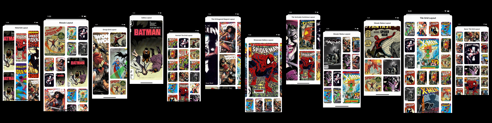

# compositional-layouts-kit 

**Last Update: 24/June/2019.**

### If you like the project, please give it a star ⭐ It will show the creator your appreciation and help others to discover the repo.

# ✍️ About
📏 A set of advanced compositional layouts for `UICollectionView` with examples [Swift 5.1, iOS 13]. All the layouts support both `portrait` and `landscape` orientations as well as support for all `iOS` and `iPadOS` related size classes.

# 📚 Contents
Please wait while the `.gif` files are loading (there are 12 files, that weight around 200Mb)...

|  |  |  |
:-------------------------:|:-------------------------:|:-------------------------:
 |  | 
 |  | 
 |  | 
 |  |  
   
# 🏗 Setup
There are no dependencies as well as any package managers involved. The project has more like a demo app setup e.g simply grab what you need for your needs. Each layout is wrapped into a separate `UIViewController` type for convenience (I could've create a separate layout factory and have just a single view controller, however, for the sake of simplicity I decided to make it possible to extract layouts with all the dependent code).

# ✈️ Usage
Simply grab a `UIViewController` type with a custom layout and adjust it for your needs. The layouts are in [here](https://github.com/jVirus/compositional-layouts-kit/tree/master/compositional-layouts-kit/Compositional%20Layouts%20VCs).

# 🆘 Tips
1. Not all layouts may look cool in landscape orientations. In order to make them look cooler and take advantage of different aspect ratio of a screen, you need to create an alternative layout that is basically the copy of the portrait layout, but has different set of fractional width and height.
2. If you want to have different layouts in portrait and landscape device orientations, you need to use either one of the following approaches:
   - Use `viewWillTransition(to size: , with coordinator:)` method (of `UIViewController` class) and `setCollectionViewLayout(, animated: completion:)` method of `UICollectionView` class to properly animate changes of layout when changing orientation.
   - More advanced and preffered approach is to implement a custom `UICollectionViewTransitionLayout`, which is (a quote from `Apple's Docs`):
   >> A special type of layout object that lets you implement behaviors when changing from one layout to another in your collection view.
   
# ⚠️ Warning 
The assets used in this project were taken from the `Web`. Do not use them for commercial purposes and proprietary projects. They are used just for demonstration only. 

# 👨‍💻 Author 
[Astemir Eleev](https://github.com/jVirus)

# 🔖 Licence 
The project is available under [MIT Licence](https://github.com/jVirus/compositional-layouts-kit/blob/master/LICENSE)
